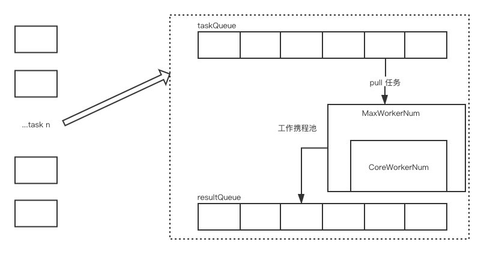

# gopool 设计
* 目标
* 效果

# 目标
> 在 go 中起协程是非常方便的, 节省资源的, 协程栈大小最大为2KB, 所以乍一看在 go 中设计协程池是多此一举的;
> 但通过 pool 可以提供统一的多任务处理模型，统一管理任务处理过程中的监控、告警;
> 且实现资源隔离(不同协程池处理不同类型任务);
> 最重要的一点: 通过确定数量的 worker 可以实现对大事务请求的异步处理, 提升系统吞吐量, 防止频繁的 new 协程模式;

# 效果

